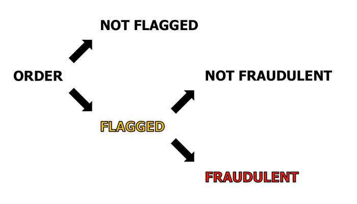

# Smyte Credit Card Fraud Detection

## Table of Contents

- [Introduction](#introduction)
- [Process](#process)
- [Benefits](#benefits)
- [Imbalanced Classes](#imbalanced-classes)
- [Metrics](#metrics)
- [Feature Engineering](#feature-engineering)
- [Models](#models)
- [Next Steps](#next-steps)
- [Notes](#notes)

##  Introduction

For my Galvanize Data Science Immersive (DSI) capstone project, I worked with [Smyte](https://www.smyte.com) on credit card fraud detection.

Specifically, I helped one of their clients to predict which flagged orders their manual reviewers would mark as fraudulent.

##  Process

Simplistically:
 1. When a customer makes a purchase, the order is either __not flagged__ or __flagged__.
 2. If the order is __flagged__, then it goes to the manual review team.
 3. The manual review team then decides whether the order is __not fraudulent__ or __fraudulent__.

##  Benefits

I used machine learning to predict which of the __flagged__ orders the manual review team will mark as __fraudulent__.
- If we can say with high probability that an order is unlikely to be marked as fraudulent by the manual reviewer, then we might as well not send the order over to be reviewed.
- This saves the client both time and money.
- The insights gained will also help Smyte to refine their rules, which is what they're using to flag orders in the first place.

In addition, it turns out that only a small percentage of the _flagged_ orders were being marked as _fraudulent_ by the manual review team.
- One can imagine that, if a reviewer is seeing mostly _not fraudulent_ orders, then s/he may be more likely to mark a _fraudulent_ order as _not fraudulent_.
- And, in fact, several _not fraudulent_ orders (as marked by the manual review team) did go on to receive _chargebacks_.
- But that's a project for Phase 2. :)

##  Imbalanced Classes

Since this was a case of imbalanced classes, I tried 3 oversampling techniques:
- No Oversampling
- Oversampling
- SMOTE (Synthetic Minority Over-sampling Technique)

__Oversampling__ tended to produce the best results, whereas no oversampling tended to produce the worst results (with regards to recall/precision).

##  Metrics

To evaluate my models, I looked at the following metrics:
- Recall
- Precision
- F1 Score
- Accuracy
- ROC AUC (Receiver Operating Characteristic Area Under the Curve)

__Recall__ was the measure I focused on the most, since I was dealing with fraud: Although the purpose of my project is to cut down on the number of flagged orders a manual reviewer has to investigate, it's still preferable to have a manual reviewer evaluate more reviews, than it is to let an actually fraudulent order slip through (up to a point).

##  Feature Engineering

I tackled features/feature engineering along roughly 4 vectors:
- Time
- Location
- User
- Transaction

(Please see [Notes](#notes).)

##  Models

These are the models I tested:
- Logistic Regression
- Random Forest
- K Nearest Neighbors
- Support Vector Machine
- Boosting
- Neural Network

__Boosting__ achieved the best results.

##  Next Steps

- Iterate
- Deploy!

##  Notes

Any lack of specifics is due to the fact that I was working with sensitive data and on a sensitive topic.
